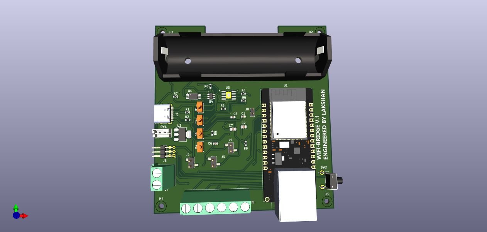

# 📶 WiFiBridge V1

### 🔧 Project Overview

**WiFiBridge V1** is a compact, battery-powered Wi-Fi bridge designed by **Lakshan Lavan**.  
It leverages the **WT32-ETH01 WiFi module** and features power-efficient circuitry, UART-based communication, and robust modularity for IoT and automation tasks.

---

## 🧩 Key Features

- ✅ WT32-ETH01 (ESP32-based WiFi + Ethernet module)
- 🔋 18650 battery integration for mobile applications
- 💡 LED indicators for:
  - Power status
  - WiFi connectivity
  - Battery charging and full charge
- 📤 Pick-and-place ready with `.csv` top position file
- 🪛 Custom KiCad footprints for modular components
- 🧠 Designed for compact routing and easy assembly

---

## 🏭 Fabrication Notes

- ✅ No Gerbers are published.  
  You can open the `.kicad_pcb` file in [KiCad](https://kicad.org/) to generate fabrication files if needed.
- Designed with **JLCPCB component compatibility** in mind.
- Supports **SMD assembly** using `.csv` pick-and-place file.

---

## ⚠️ Disclaimer

This project is open-source and provided as-is. Modify, improve, or integrate it freely into your own systems.

---

## 👤 Author

**Lakshan Lavan**  
Embedded Systems | Robotics | PCB Design  
[LinkedIn](https://www.linkedin.com/in/lakshan29) | [Email](mailto:lakshanlavan29@gmail.com)
